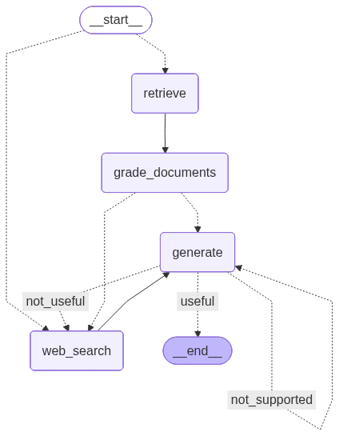

# Corrective-RAG (CRAG) Implementation

This project implements **Corrective Retrieval-Augmented Generation (CRAG)**, a framework designed to enhance the robustness of RAG systems by self-correcting retrieval results. It addresses the common issue where Large Language Models (LLMs) may hallucinate when provided with irrelevant or low-quality retrieved documents.

## Introduction

Standard Retrieval-Augmented Generation (RAG) often indiscriminately incorporates retrieved documents into the generation process, regardless of their relevance. This project implements the CRAG framework, which introduces a retrieval evaluator to assess document quality and trigger different actions — such as refinement or external web searches — to ensure the generator receives the most accurate knowledge.

## Key Features

- **Lightweight Retrieval Evaluation**: Evaluates the relevance of retrieved documents to the user query before they are used for generation.

- **Knowledge Correction**: Discards irrelevant documents and triggers a web search extension to fill knowledge gaps.

- **Adaptive Workflow**: Uses LangGraph to manage a stateful workflow that can route queries between local vector stores and the web.

- **Post-Generation Verification**: Includes self-reflection steps to grade answers for hallucinations and utility, drawing inspiration from Self-RAG.

## System Architecture

The workflow follows a directed graph managed by `langgraph`:

1) **Routing**: Determines if the query should go to the vector store or directly to web search.

1) **Retrieval**: Fetches relevant documents from a Qdrant vector store.

1) **Grading**: A "Retrieval Evaluator" checks the relevance of each document. If a document is deemed irrelevant, a web search flag is set.

1) **Web Search**: If needed, the system uses Tavily to supplement the knowledge base with fresh web data.

1) **Generation**: Produces an answer using the refined context.

1) **Self-Correction**: Verifies the answer against the documents (Hallucination Grade) and the question (Answer Grade).

<p align="center"></p>

## Installation & Setup

1) **Environment**: Requires Python 3.10+ and a tool like uv or pip for dependency management.

2) **Configuration**: Set the following environment variables:

    | Variable | Description |
    |----------|-------------|
    | `OPENAI_API_KEY` | For LLM and embeddings. |
    | `QDRANT_URL` | For the vector store (defaults to `http://localhost:6333`). |
    | `TAVILY_API_KEY` | For web search capabilities. |

## CLI Usage

The project includes a CLI via main.py:

- Ingest Documents: Load data into the vector store.

    ```bash
    python main.py ingest ./path/to/docs
    ```

- Invoke Agent: Ask a question.

    ```bash
    python main.py invoke "What is Corrective RAG?"
    ```

- Visualize Graph: Save the LangGraph workflow as an image.

    ```bash
    python main.py visualize ./graph.png
    ```

## References

- _Corrective Retrieval Augmented Generation_, Anonymous Authors, Under review at ICLR 2025.

- _Self-RAG: Learning to Retrieve, Generate, and Critique Through Self-Reflection_, Akari Asai et al., ICLR 2024.

- _Adaptive-RAG: Learning to Adapt Retrieval-Augmented LLMs through Question Complexity_, Soyeong Jeong et al., 2024.